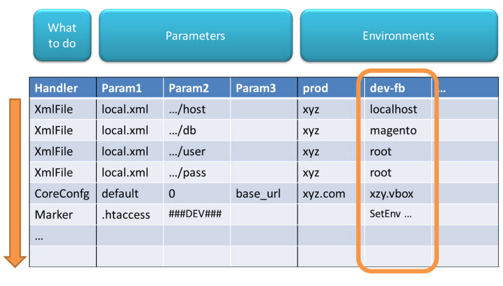

What is EnvSettingsTool?
========================

Author: [Fabrizio Branca](https://twitter.com/fbrnc)

EnvSettingsTool offers a concept to adjust settings for applications.
Typically it is used during deployment.
The settings for every Environment can be maintained in an CSV file.

CSV File
--------

This is an example CSV file:

| Handler                            | Param1            | Param2                                                 | Param3             | DEFAULT   | devbox | integration | staging | production |
| ---------------------------------- | ----------------- | ------------------------------------------------------ | ------------------ |---------- | ------ | ----------- | ------- | ---------- |
| # Database parameters              |                   |                                                        |                    |           |        |             |         |            |
| Est_Handler_XmlFile                | app/etc/local.xml | /config/global/resources/default_setup/connection/host |                    | localhost |        |             |         |            |
| # Dev settings                     |                   |                                                        |                    |           |        |             |         |            |
| Est_Handler_Magento_CoreConfigData | default           | 0                                                      | dev/debug/profiler | 0         | 1      |             |         |            |

Each row is one setting. A setting is changed by a "handler", and each handler support up to 3 parameters.
The next columns represent the values for the environments, and you may use the "DEFAULT" key for a default setting.
Empty column values will fall back to the "DEFAULT" column (instead of setting an empty value). If you want to set an empty value instead
configure that cell with `--empty--` and it will set an empty value instead of falling back.

Usage
-----
The tool comes with 3 commands:

### Dry-Run

Just print out the Handler and Values that would be executed:

    php dryRun.php devbox ../settings.csv

### Apply

Execute the handlers and show status summary:

    php apply.php devbox ../settings.csv

### Get single value

Returns the value for a certain handler. For example - this can be used to get database values for other scripts:

    php value.php devbox ../Settings.csv HandlerName param1 param2 param3

Example

    DB_HOST=`EnvSettingsTool/value.php ${ENVIRONMENT} settings.csv Est_Handler_XmlFile app/etc/local.xml /config/global/resources/default_setup/connection/host`

## Example setup script snippet

    echo "Appling settings"
    cd htdocs
    php ../Setup/EnvSettingsTool/apply.php ${ENVIRONMENT} ../Setup/Settings.csv || exit 1

## Handlers

* **Est_Handler_XmlFile**: Can change values in XML

    * Param1: Relative Path to XML File (relative to current directory)
    * Param2: XPath
    * Param3: not used

* **Est_Handler_Magento_CoreConfigData**: Changes values of core_config_data table in a Magento instance. It reads its database parameters from app/etc/local.xml - therefore it needs to be placed after any adjustments of DB credentials.

    * Param1: scope ('default', 'stores', 'websites', or '%')
    * Param2: scopeid (store id, store code, website id, website code, 0 for default scope or '%')
    * Param3: path

    * Special features:
        * If the value field of a row for the current environment is `--delete--` the matched row will be deleted
        * param1, param2, or param3 can use the wildcard `%` instead a concrete values. This will make EnvSettingsTool apply the value to multiple existing rows.
        * If scope is `stores` the scope id can be a store code instead of a store id.
        * If scope is `website` the scope id can be a website code instead of a website id.

* **Est_Handler_MarkerReplace**: Simply replaces a given marker in a file

    * Param1: Relative Path to File (relative to current directory)
    * Param2: Marker that will be replaced
    * Param3: not used

* **Est_Handler_AddFileContent**: Adds the content from one file to the content of another file

    * Param1: targetFile path
    * Param2: 'before', 'after', 'prepend', or 'append'
    * Param3: not used
    * Value: contentFile path

* **Est_Handler_PrependFileContent**: Prepends the content from one file to the content of another file (This is just a shortcut for the AddFileContent handler)

    * Param1: targetFile path
    * Param2: not used
    * Param3: not used
    * Value: contentFile path

* **Est_Handler_SetVar**: Allows you to set variables that can be used in all following handlers using `###VAR:<variableName>###`

    * Param1: variable name
    * Param2: not used
    * Param3: not used

* **Est_Handler_CopyFile**: Allows you to copy a file from sourceFile path to targetFile path.

    * Param1: targetFile path
    * Param2: not used
    * Param3: not used
    * Value: sourceFile path
    
* **Est_Handler_Magento_EavEntityStore**: Sets a predefined increment prefix. The last increment id will be set to <store-id><prefix>00000000.

    * Param1: entity type code or entity type id
    * Param2: store code or store id
    * Param3: increment prefix

* **Est_Handler_Magento_AdminUserActivate**: Allows to enabled/disabled admin user accounts based on username, email or roles (wildcards supported)

    * Param1: Username
    * Param2: Email
    * Param3: Rolename
    * Value: 1=enabled, 0=disabled
    
* **Est_Handler_Magento_StoreActivate**: Enables/disables an existing store

    * Param1: store id or code 
    * Param2: not used
    * Param3: not used
    * Value: 0 for disable, 1 for enable

* **Est_Handler_Magento_Api2AclRule**: Configures Mage_Api2 rules

    * Param1: role_id or role name
    * Param2: resource_id
    * Param3: privilege
    * Value: 0/--delete-- for delete, 1/--insert-- for insert

* **Est_Handler_Magento_ApiUser**: Can create, update and delete API users.
    
    * Create User 
        * Param1: username  
        * Param2: email
        * Param3: password
        * Environment: --insert--

    * Update user
        * Param1: user_id or username
        * Param2: field (field to update)
        * Param3: value (if field == api_key the value gets md5 hashed)
        * Environment: --update--
    
    * Delete user
        * Param1: user_id or username
        * Environment: --delete--

* **Est_Handler_Magento_ApiRole**: Can create, update and delete API roles / users.
    
    * Add role
        * Param1: role_name or role_id
        * Value: --insert--
        
    * Add user to role
        * Param1: role_name or role_id
        * Param2: username or user_id
        * Value: --insert--

    * Remove role
        * Param1: role_name or role_id
        * Value: --delete--
        
    * Remove user from role
        * Param1: role_name or role_id
        * Param2: username or user_id
        * Value: --delete--
        
* **Est_Handler_Magento_ApiRule**: Can add or remove resources to an API role
    
    * Add resource to an API role
        * Param1: role_name or role_id
        * Param2: resource_id // many: comma separated
        * Param3: allow|deny
        * Value: --insert--

    * Remove resource to an API role
        * Param1: role_name or role_id
        * Param2: resource_id // many: comma separated OR * for all resoruces
        * Value: --insert--
        
* **Est_Handler_Magento_DatabaseTableTruncate**: Truncates tables
    
    * Param1: table         // can be table_* f.e. to find many tables
    * Param2: no_fk_check   // turns of foreign key check; leave blank for having checks enabled
    * Value: --truncate--   // must be set otherwise it skips the row

* **Est_Handler_Magento_DatabaseTableDrop**: Drop tables
    
    * Param1: table         // can be table_* f.e. to find many tables
    * Param2: no_fk_check   // turns of foreign key check; leave blank for having checks enabled
    * Value: --drop--       // must be set otherwise it skips the row

## Special Features

### Comments and empty lines

Empty lines or lines starting with '#' or '/' will be ignored. Use this to insert some comments into the csv file.

### Skipping rows

If the value field of a row for the current environment is `--skip--` this handler will not be executed

### Environment variables

The Values also support the special syntax `###ENV:VARIABLE###` to read stuff from the (bash) environment Variables.

### Reading file content

The special syntax `###FILE:filename###` allows to read the content of a file and insert the trimmed value.

Example:

    Est_Handler_XmlFile('app/etc/local.xml', '/config/global/cache/id_prefix', '') = x###FILE:../build.txt###_
    
Will read the content of ../build.txt and insert it in the id_prefix node: x72_

### Loops

param1, param2 and param3 can specify loops using this syntax: `{{1|2|3}}`. In this case the same handler will be executed multiple times using every values.
It's also possible to have loops in two or all three parameters. In this case all combinations will be executed.

Example:

    Est_Handler_Magento_CoreConfigData('stores', '{{1|2|3}}', 'web/unsecure/base_url') = 'http://www.foo.com'

Is equal to:

    Est_Handler_Magento_CoreConfigData('stores', '1', 'web/unsecure/base_url') = 'http://www.foo.com'
    Est_Handler_Magento_CoreConfigData('stores', '2', 'web/unsecure/base_url') = 'http://www.foo.com'
    Est_Handler_Magento_CoreConfigData('stores', '3', 'web/unsecure/base_url') = 'http://www.foo.com'

This loop resolution now also works within paramters:

    Est_Handler_Magento_CoreConfigData('stores', '1', 'a/b/{{c|d|e}}') = 'http://www.foo.com'

Is equal to:

    Est_Handler_Magento_CoreConfigData('stores', '1', 'a/b/c') = 'http://www.foo.com'
    Est_Handler_Magento_CoreConfigData('stores', '1', 'a/b/d') = 'http://www.foo.com'
    Est_Handler_Magento_CoreConfigData('stores', '1', 'a/b/e') = 'http://www.foo.com'

Multiple loops are also support within the same parameter:

    Est_Handler_Magento_CoreConfigData('stores', '1', '{{a|b}}_{{c|d}') = 'http://www.foo.com'

Is equal to:

    Est_Handler_Magento_CoreConfigData('stores', '1', 'a_c') = 'http://www.foo.com'
    Est_Handler_Magento_CoreConfigData('stores', '1', 'a_d') = 'http://www.foo.com'
    Est_Handler_Magento_CoreConfigData('stores', '1', 'b_c') = 'http://www.foo.com'
    Est_Handler_Magento_CoreConfigData('stores', '1', 'b_d') = 'http://www.foo.com'

Empty values in loops are also allowed:

    Est_Handler_Magento_CoreConfigData('stores', '1', 'web/secure/base{{_skin|_media|_js|}}_url') = 'http://www.foo.com'

Is equal to:

    Est_Handler_Magento_CoreConfigData('stores', '1', 'web/secure/base_skin_url') = 'http://www.foo.com'
    Est_Handler_Magento_CoreConfigData('stores', '1', 'web/secure/base_media_url') = 'http://www.foo.com'
    Est_Handler_Magento_CoreConfigData('stores', '1', 'web/secure/base_js_url') = 'http://www.foo.com'
    Est_Handler_Magento_CoreConfigData('stores', '1', 'web/secure/base_url') = 'http://www.foo.com'

### Fallback

An empty cell falls back the configured DEFAULT column. If you actually need that value to be empty use `--empty--` instead.

### References to other environments

You can reference to values from another environment by adding this to the value: `###REF:targetenvironment###`

### Special markers

* `###ENVIRONMENT###` will be replaced with current environment name (e.g. "production"). This replacement is done after resolving any references to other environments. So the environment being inserted here is always the actual environment requested and not the one of a referenced value.
* `###CWD###` will be replaced with the path to the current working directory.
* `###PARAM1###` will be replaced with the given param1. Also works if the parameter is given in the loop syntax `{{..|..}}`. Then the individual value will be set.
* `###PARAM2###` will be replaced with the given param2. Also works if the parameter is given in the loop syntax `{{..|..}}`. Then the individual value will be set.
* `###PARAM3###` will be replaced with the given param3. Also works if the parameter is given in the loop syntax `{{..|..}}`. Then the individual value will be set.

## Ignore errors

If a handler name if prefixed with `@` then this error will be ignored and the apply command continues walking through the list.

## Groups

The csv settings file can cotain another column labelled with "GROUPS" (all uppercase!). Every value in this column can be a comma separated list of groups (or 'tags' if you like)
similar to how PHPUnit handles groups.

When calling the apply.php script you can pass `--groups <comma-separated list of groups>` or `--exclude-groups <comma-separated list of groups>`.
If `--groups` is set only the lines will be processed that have at least one of the groups passed as a parameter. If `--exclude-groups` is set the lines will be skipped if they
have at least one group in common with what is specified.

Please note that the argument does not support '=' but only spaces. (use `--groups db`, not `--groups=db`)

Example:

    # Will only execute rows tagged with 'db'
    ./apply.php devbox ../Configuration/settings.csv --groups db

    # Will skip executing rows tagged with 'db'
    ./apply.php devbox ../Configuration/settings.csv --exclude-groups db

## Tips and tricks

### Admin user management

Disable all admin users:

    Est_Handler_Magento_AdminUserActivate('%', '%', '%') = 0
    
Enable user 'john.doe':

    Est_Handler_Magento_AdminUserActivate('john.doe', '%', '%') = 1
    
Enable user with email address 'info@example.com':

    Est_Handler_Magento_AdminUserActivate('%', 'info@example.com', '%') = 1
    
Enable all user with email addresses '...@example.com':
    
    Est_Handler_Magento_AdminUserActivate('%', '%@example.com', '%') = 1
    
Enable all users with role 'Customer Service':    

    Est_Handler_Magento_AdminUserActivate('%', '%', 'Customer Service') = 1

Remember that EnvSettingsTool processes the csv file from top to bottom. You can use this to add exact control over what accounts should be enabled or not.

### Delete values

If you're setting Magento core_config_data values and you want to be sure that there's no other value that might interfere with your values (e.g. in a different scope) you can delete all values first:

| Handler                            | Param1  | Param2 | Param3             | DEFAULT    |
| ---------------------------------- | ------- | ------ | ------------------ |----------- |
| Est_Handler_Magento_CoreConfigData | %       | %      | dev/debug/profiler | --delete-- |
| Est_Handler_Magento_CoreConfigData | default | 0      | dev/debug/profiler | 0          |

### Use via Composer

Add this to your composer.json to resolve the dependency through composer:

    "repositories": [
        {
            "type": "vcs",
            "url": "https://github.com/AOEpeople/EnvSettingsTool"
        }
    ],
    "require": {
        "aoepeople/envsettingstool": "~1.0"
    }

## Changelog

### Version 1.0.0

* Added composer support

### Version 1.1.0

* Added support for arguments
* Added --groups and --exclude-groups feature

### Version 1.2.0

* Added support for Magento admin users
